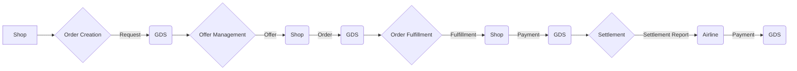
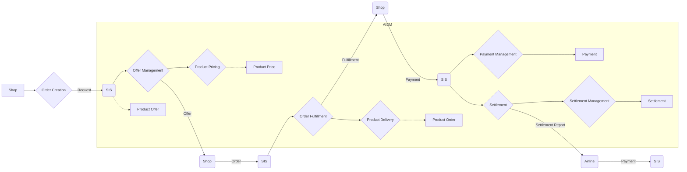

```mermaid
graph LR
A[Shop] --> B{Order Creation}
B -->|Request| C(GDS)
C --> D{Offer Management}
D -->|Offer| E(Shop)
E -->|Order| F(GDS)
F --> G{Order Fulfillment}
G -->|Fulfillment| H(Shop)
H -->|Payment| I(GDS)
I --> J{Settlement}
J -->|Settlement Report| K(Airline)
K -->|Payment| L(GDS)
```

```mermaid
graph LR
A[Shop] --> B{Order Creation}
B -->|Request| C(SIS)
C --> D{Offer Management}
D -->|Offer| E(Shop)
E -->|Order| F(SIS)
F --> G{Order Fulfillment}
G -->|Fulfillment| H(Shop)
H -->|Payment| I(SIS)
I --> J{Settlement}
J -->|Settlement Report| K(Airline)
K -->|Payment| L(SIS)

subgraph AIDM
    C -.-> M[Product Offer]
    D --> N{Product Pricing}
    N -.-> O[Product Price]
    G --> P{Product Delivery}
    P -.-> Q[Product Order]
    I --> R{Payment Management}
    R --> S[Payment]
    J --> T{Settlement Management}
    T --> U[Settlement]
end
```