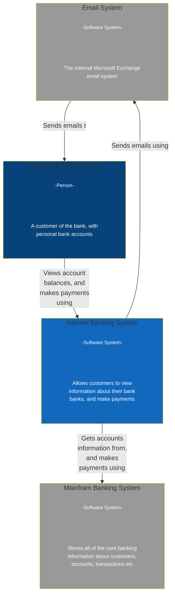
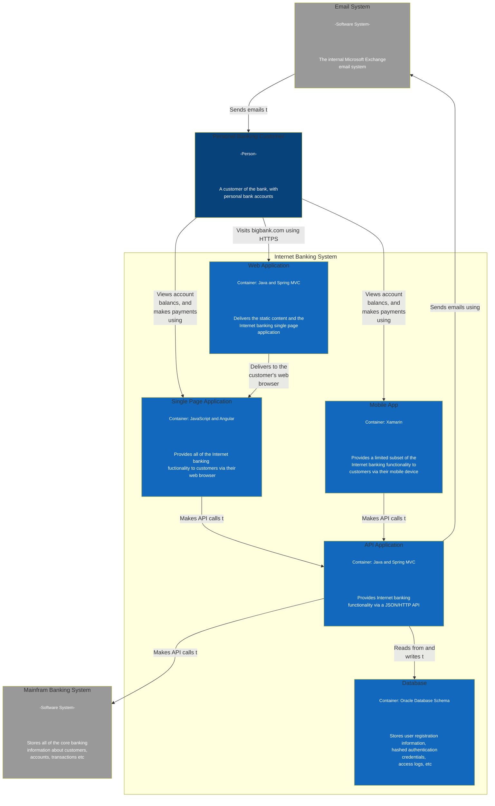
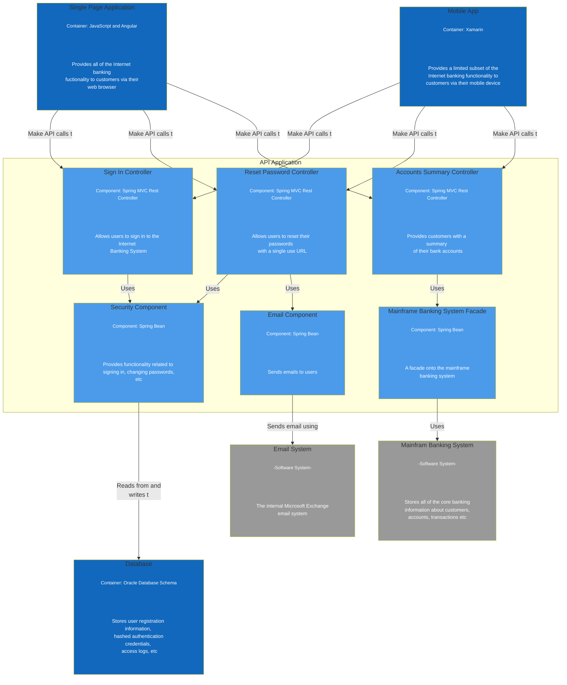
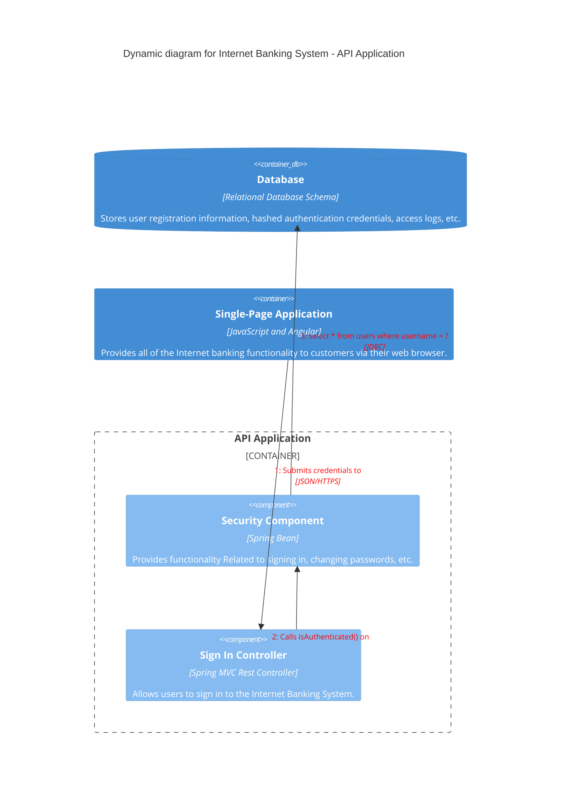

# C4 Sample Diagrams

- thanks to Luke Merrett for these examples:  https://lukemerrett.com/building-c4-diagrams-in-mermaid/
- experimental diagrams from the mermaid site:  https://mermaid.js.org/syntax/c4c.html
  - used only for Level 4 diagrams

## Level 1: System Context Diagram

## Level 2: Container Diagram

## Level 3: Component Diagram

## Level 4: Code Diagram (Dynamic)

