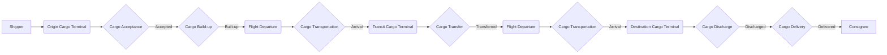
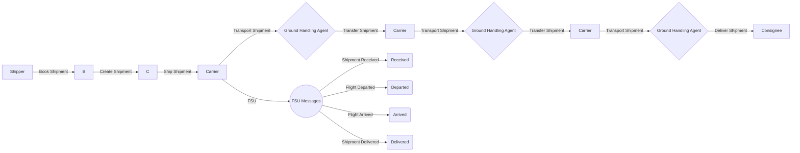
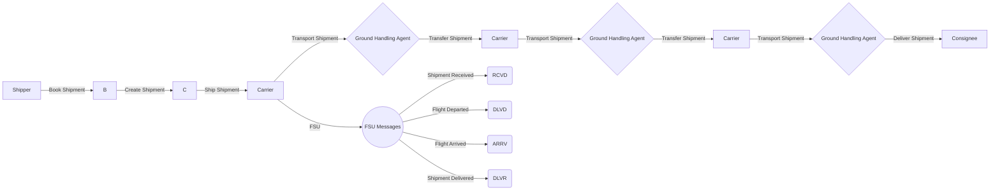

```mermaid
graph LR
A[Shipper] --> B(Origin Cargo Terminal)
B --> C{Cargo Acceptance}
C -->|Accepted| D{Cargo Build-up}
D -->|Built-up| E(Flight Departure)
E --> F{Cargo Transportation}
F -->|Arrival| G(Transit Cargo Terminal)
G --> H{Cargo Transfer}
H -->|Transferred| I(Flight Departure)
I --> J{Cargo Transportation}
J -->|Arrival| K(Destination Cargo Terminal)
K --> L{Cargo Discharge}
L -->|Discharged| M{Cargo Delivery}
M -->|Delivered| N[Consignee]
```

```mermaid
graph LR
A[Shipper] -->|Book Shipment| B
B -->|Create Shipment| C
C -->|Ship Shipment| D[Carrier]
D -->|Transport Shipment| E{Ground Handling Agent}
E -->|Transfer Shipment| F[Carrier]
F -->|Transport Shipment| G{Ground Handling Agent}
G -->|Transfer Shipment| H[Carrier]
H -->|Transport Shipment| I{Ground Handling Agent}
I -->|Deliver Shipment| J[Consignee]
D -->|FSU| K((FSU Messages))
K -->|Shipment Received| L(Received)
K -->|Flight Departed| M(Departed)
K -->|Flight Arrived| N(Arrived)
K -->|Shipment Delivered| O(Delivered)
```

```mermaid
graph LR
A[Shipper] -->|Book Shipment| B
B -->|Create Shipment| C
C -->|Ship Shipment| D[Carrier]
D -->|Transport Shipment| E{Ground Handling Agent}
E -->|Transfer Shipment| F[Carrier]
F -->|Transport Shipment| G{Ground Handling Agent}
G -->|Transfer Shipment| H[Carrier]
H -->|Transport Shipment| I{Ground Handling Agent}
I -->|Deliver Shipment| J[Consignee]
D -->|FSU| K((FSU Messages))
K -->|Shipment Received | L(RCVD)
K -->|Flight Departed | M(DLVD)
K -->|Flight Arrived | N(ARRV)
K -->|Shipment Delivered | O(DLVR)
```