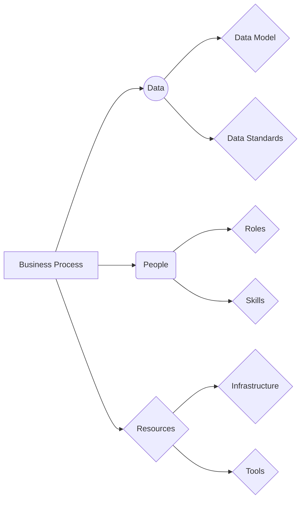
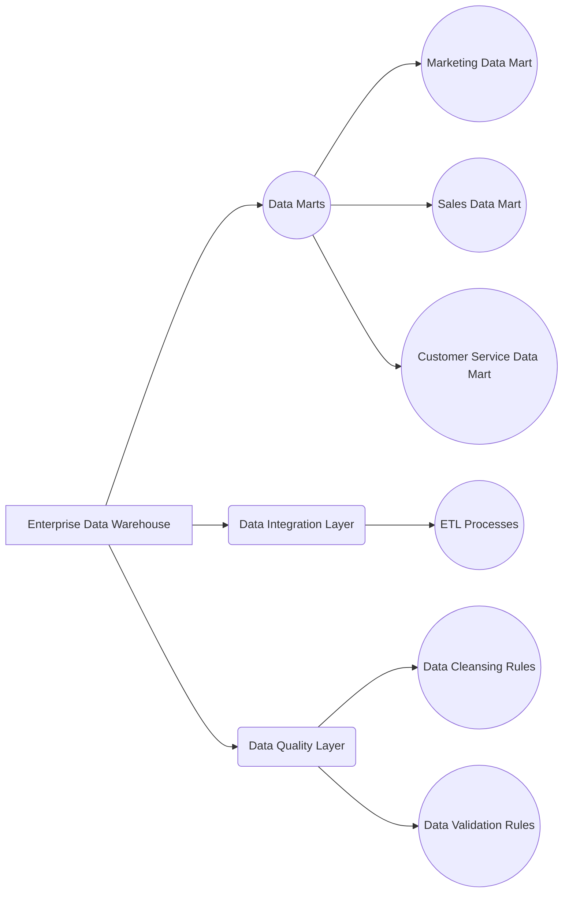
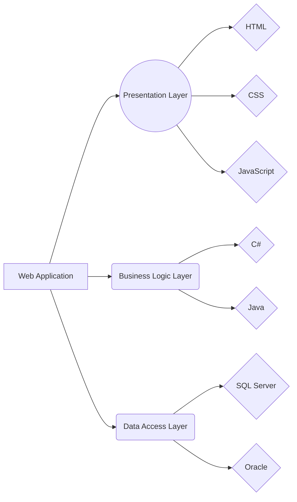
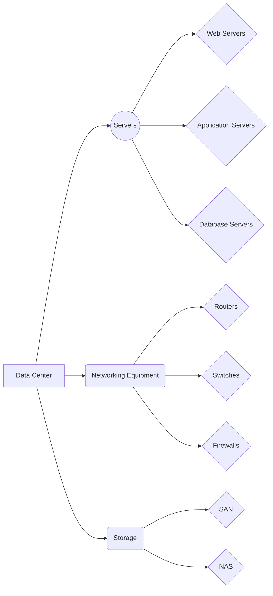

# EA Sample Diagrams

## Business Architecture

```mermaid
graph LR
    A[Business Process] --> B((Data))
    A --> C(People)
    A --> D{Resources}
    B --> E{Data Model}
    B --> F{Data Standards}
    C --> G{Roles}
    C --> H{Skills}
    D --> I{Infrastructure}
    D --> J{Tools}
```

## Information Architecture

```mermaid
graph LR
    A[Enterprise Data Warehouse] --> B((Data Marts))
    A --> C(Data Integration Layer)
    A --> D(Data Quality Layer)
    B --> E((Marketing Data Mart))
    B --> F((Sales Data Mart))
    B --> G((Customer Service Data Mart))
    C --> H((ETL Processes))
    D --> I((Data Cleansing Rules))
    D --> J((Data Validation Rules))
```

## Application Architecture

```mermaid
graph LR
    A[Web Application] --> B((Presentation Layer))
    A --> C(Business Logic Layer)
    A --> D(Data Access Layer)
    B --> E{HTML}
    B --> F{CSS}
    B --> G{JavaScript}
    C --> H{C#}
    C --> I{Java}
    D --> J{SQL Server}
    D --> K{Oracle}
```

## Technology Architecture

```mermaid
graph LR
    A[Data Center] --> B((Servers))
    A --> C(Networking Equipment)
    A --> D(Storage)
    B --> E{Web Servers}
    B --> F{Application Servers}
    B --> G{Database Servers}
    C --> H{Routers}
    C --> I{Switches}
    C --> J{Firewalls}
    D --> K{SAN}
    D --> L{NAS}
```