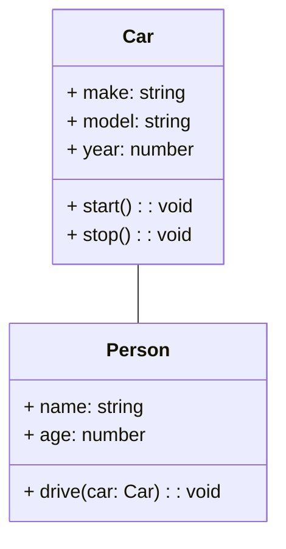
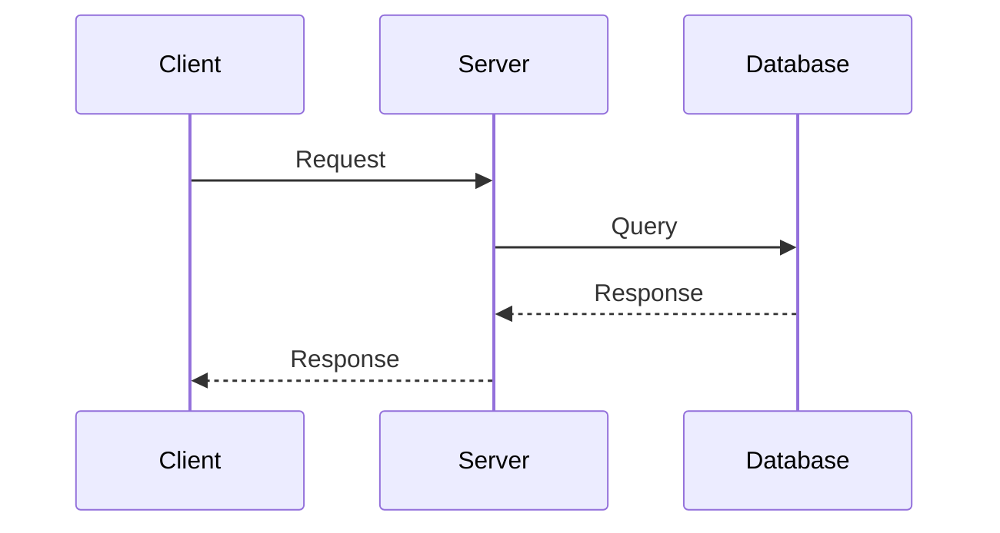
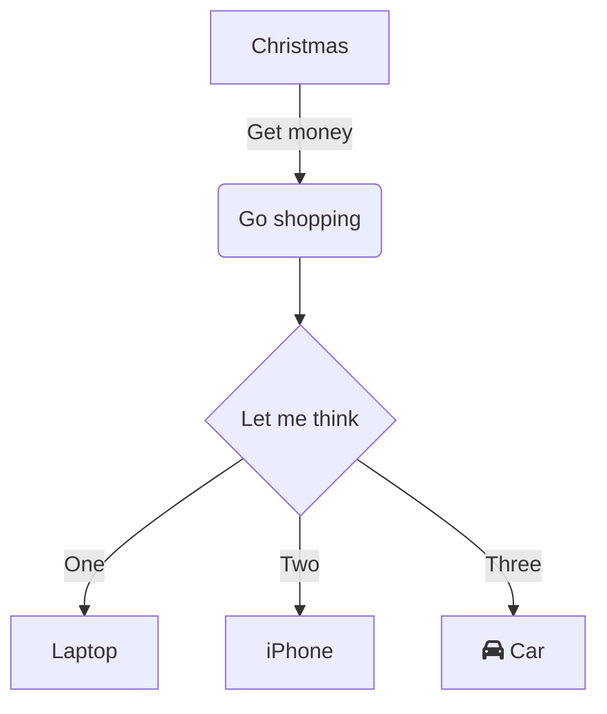
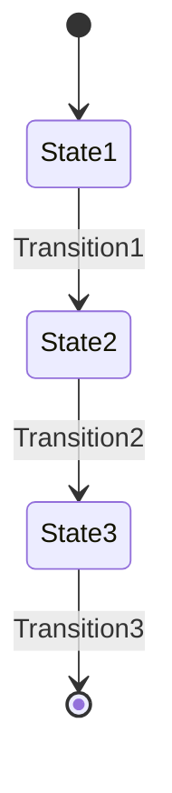

# UML Sample Diagrams

## Class Diagram

```mermaid
classDiagram
    class Car {
        + make: string
        + model: string
        + year: number
        + start(): void
        + stop(): void
    }
    class Person {
        + name: string
        + age: number
        + drive(car: Car): void
    }
    Car -- Person
```

## Sequence Diagram

```mermaid
sequenceDiagram
    participant Client
    participant Server
    Client ->> Server: Request
    Server ->> Database: Query
    Database -->> Server: Response
    Server -->> Client: Response
```

## Activity Diagram (Flow Diagram)

```mermaid
flowchart TD
    A[Christmas] -->|Get money| B(Go shopping)
    B --> C{Let me think}
    C -->|One| D[Laptop]
    C -->|Two| E[iPhone]
    C -->|Three| F[fa:fa-car Car]
```

## State Diagram

```mermaid
stateDiagram
    [*] --> State1
    State1 --> State2 : Transition1
    State2 --> State3 : Transition2
    State3 --> [*] : Transition3
```